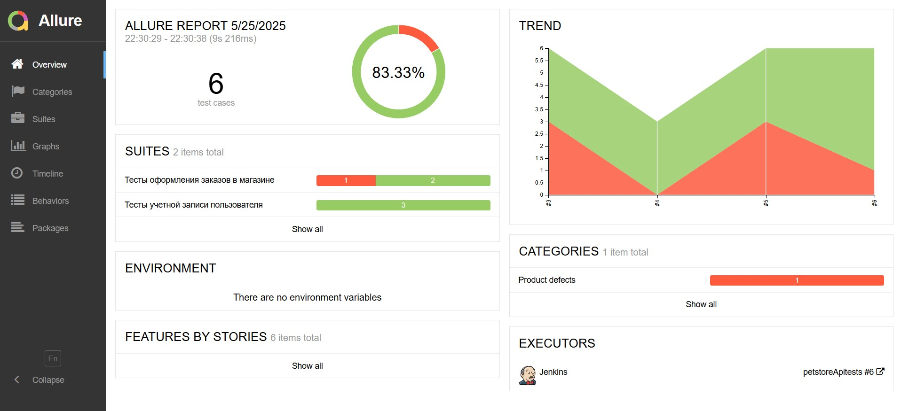
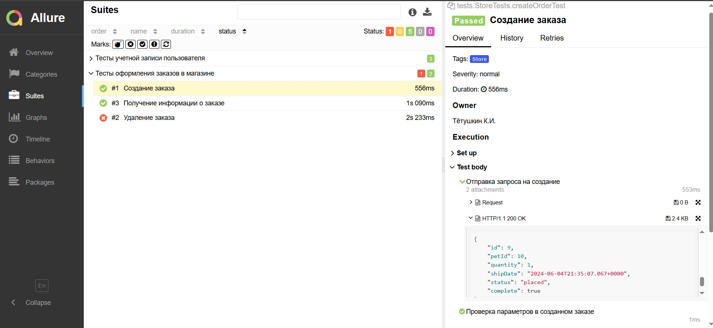
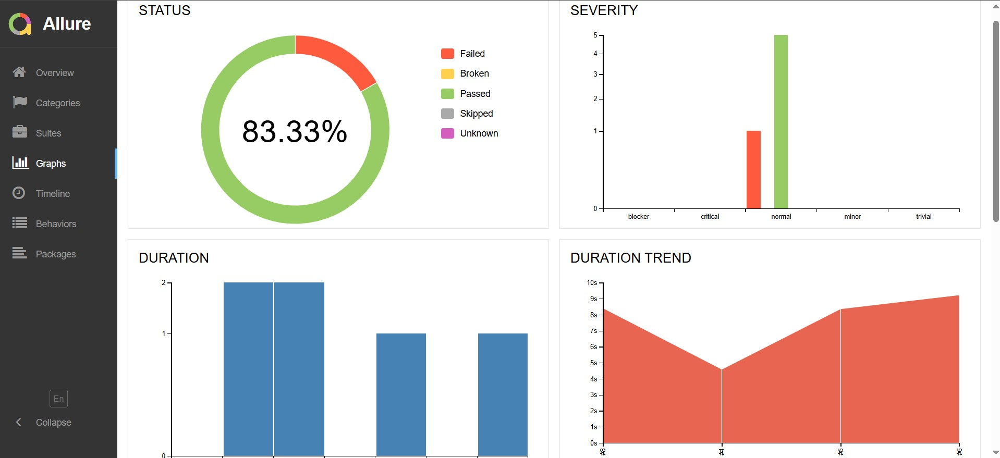
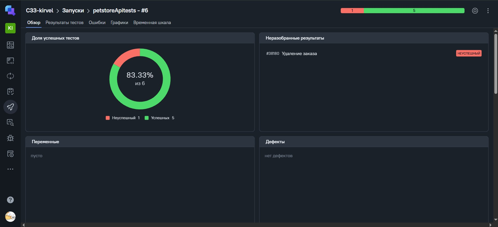
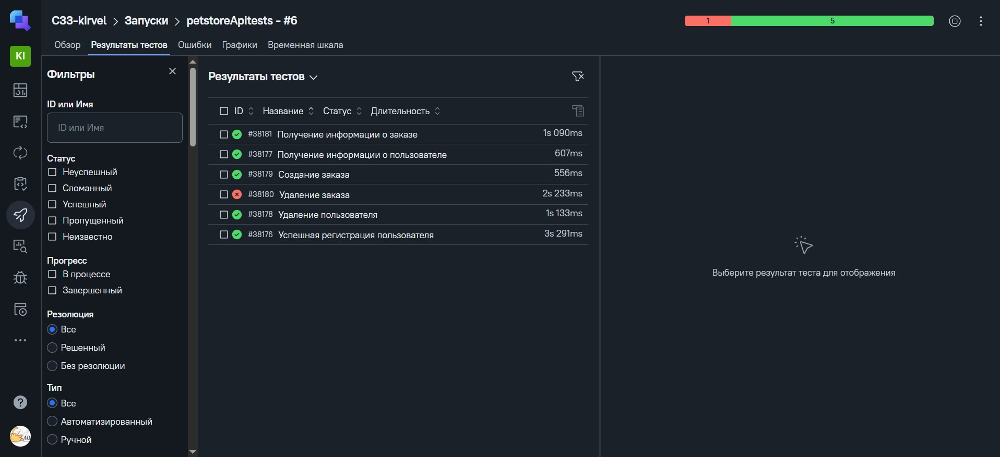

<h1 align="center"> Проект по автоматизации тестирования для сайта 
<a href="https://petstore.swagger.io"> petstore.swagger.io</a> 
</h1>     


  
>petstore.swagger.io — это пример сервера для зоомагазина.
____
## **Содержание:**


* <a href="#tools">Технологии и инструменты</a>

* <a href="#cases">Примеры автоматизированных тест-кейсов</a>

* <a href="#jenkins">Сборка в Jenkins</a>

* <a href="#console">Запуск из терминала</a>

* <a href="#allure">Allure отчет</a>

* <a href="#allure-testops">Интеграция с Allure TestOps</a>

* <a href="#jira">Интеграция с Jira</a>

* <a href="#telegram">Уведомление в Telegram при помощи бота</a>
____

<a id="tools"></a>

## <a name="Технологии и инструменты">**Технологии и инструменты:**</a>
<p align="center">  
<a href="https://www.jetbrains.com/idea/"></a>  
<a href="https://www.java.com/"></a>  
<a href="https://github.com/"></a>  
<a href="https://junit.org/junit5/"></a>  
<a href="https://gradle.org/"></a>  
<a href="https://selenide.org/"></a>  
<a href="ht[images](images)tps://github.com/allure-framework/allure2"></a> 
<a href="https://qameta.io/"></a>   
<a href="https://www.jenkins.io/"></a>  
<a href="https://www.atlassian.com/ru/software/jira/"></a>  
</p>

Тесты написаны на языке <code>Java</code> с использованием фреймворка для автоматизации тестирования <code>Selenide</code>, сборщик - <code>Gradle</code>.

<code>JUnit 5</code> задействован в качестве фреймворка модульного тестирования.
При прогоне тестов для удаленного запуска используется <code>Selenoid</code>.

Для удаленного запуска реализована джоба в <code>Jenkins</code> с формированием Allure-отчета и отправкой результатов в <code>Telegram</code> при помощи бота.
Также реализована интеграция с <code>Allure TestOps</code> и <code>Jira</code>.
API тесты реализованы при помощи <code>RestAssured</code>.

____

<a id="cases"></a>

## <a name="Примеры автоматизированных тест-кейсов">**Примеры автоматизированных тест-кейсов:**</a>

-  *Успешная регистрация пользователя*
-  *Получение информации о пользователе*
-  *Удаление пользователя*
-  *Создание заказа*
-  *Получение информации о заказе*
-  *Удаление заказа*


____
<a id="jenkins"></a>
## <a name="Сборка"></a>Сборка в [Jenkins](https://jenkins.autotests.cloud/job/petstoreApitests)</a>
### **Параметры сборки в Jenkins:**

- *task (выбор группы тестов для запуска, по умолчанию все - test)*


<a id="console"></a>
## Команды для запуска из терминала
___
***Локальный запуск:***
```bash  
gradle clean test
```


***Удалённый запуск через Jenkins:***
```bash  
clean test
```

___
<a id="allure"></a>
## <a name="Allure"></a>Allure [отчет](https://jenkins.autotests.cloud/job/petstoreApitests/)</a>
___

### *Основная страница отчёта*

<p align="center">  
  
</p>  

### *Тест-кейсы*

<p align="center">  
  
</p>

### *Графики*

  <p align="center">  


___
<a id="allure-testops"></a>
## Интеграция с <a target="_blank" href="https://allure.autotests.cloud/launch/46538">Allure TestOps</a>
____
### *Allure TestOps Dashboard*

<p align="center">  
  
</p>  

### *Авто тест-кейсы*

<p align="center">  
  
</p>
